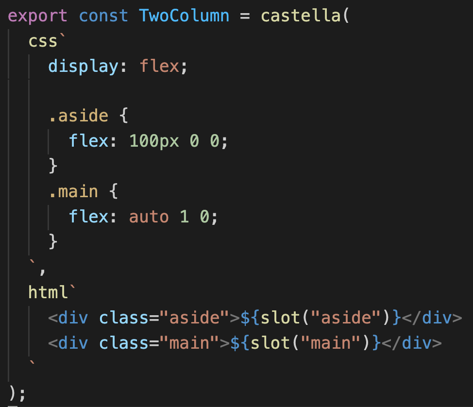

# Castella: CSS in JS for React, Backed by Web Components



**Castella** is a Web Component-based CSS in JS library for React.

```sh
npm install @castella/runtime @castella/macro
```

## How Castella Works?

Castella creates a React component from given CSS string and HTML fragment. The generated component puts these CSS and HTML into its shadow DOM.

Due to the nature of Shadow DOM, given CSS affects only to the paired HTML fragment. The HTML in Shadow dom is neither affected by CSS other than the paired one.

Castella is implemented as a [Babel macro](https://github.com/kentcdodds/babel-plugin-macros) to minimize runtime overhead.

## Usage

To make Castella work, set up Babel macro (see below).

Import `castella`, `css`, `html` and `slot` from `@castella/macro`. The `castella` function receives a CSS string which is created by `css` and an HTML object which is created by `html`. In order to let your component receive children, place `${slot()}` in your HTML string.

```ts
export const Counter = castella(
  css`
    display: flex;
    flex-flow: nowrap row;
    justify-content: center;
    align-items: center;
    box-sizing: border-box;
    width: 80px;
    height: 80px;
    border: 1px solid #cccccc;
    padding: 2px;
    font-size: 1.5em;
  `,
  html` <div>${slot()}</div> `
);
```

The resulting component can be used as a normal React component:

```tsx
<Counter>1</Counter>
```

This will render something like below:

```html
<castella-counter-1e4ac9>
  #shadow-dom
    <style>
      :host {
        display: flex;
        flex-flow: nowrap row;
        justify-content: center;
        align-items: center;
        box-sizing: border-box;
        width: 80px;
        height: 80px;
        border: 1px solid #cccccc;
        padding: 2px;
        font-size: 1.5em;
      }
    </style>
    <div><slot></slot></div>
  1
</castella-counter-1e4ac9>
```

### Named Slots

To let Castella components receive multiple children, you can use named slots.

```ts
export const TwoColumn = castella(
  css`
    display: flex;

    .aside {
      flex: 100px 0 0;
    }
    .main {
      flex: auto 1 0;
    }
  `,
  html`
    <div class="aside">${slot("aside")}</div>
    <div class="main">${slot("main")}</div>
  `
);
```

Usage of this component would be:

```tsx
<TwoColumn
  aside={<div>I am aside</div>}
  main={<MainContents />}
/>
```

## Setting up

First, set up Babel if you haven't.

Then, install [babel-plugin-macros](https://github.com/kentcdodds/babel-plugin-macros) and set it up. For example, your `.babelrc` would be like:

```json
{
  "plugins": ["babel-plugin-macros"],
  "presets": [
    "@babel/preset-typescript",
    "@babel/preset-react"
  ]
}
```

That's all!

If you are using create-react-app, babel-plugin-macros is already there.

## Example

This repository contains the `example/` directory where you can see some usage of Castella and also compare Castella with [styled-components](https://styled-components.com/) and [linaria](https://github.com/callstack/linaria).

## Contributing

Welcome

## License

MIT